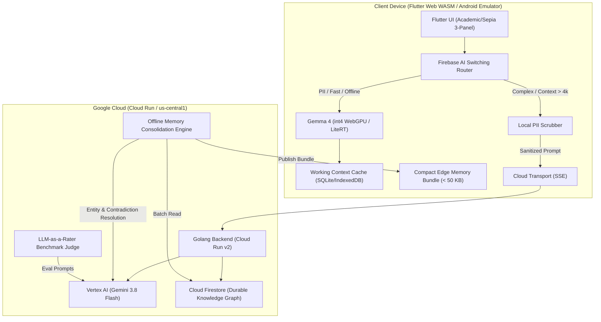
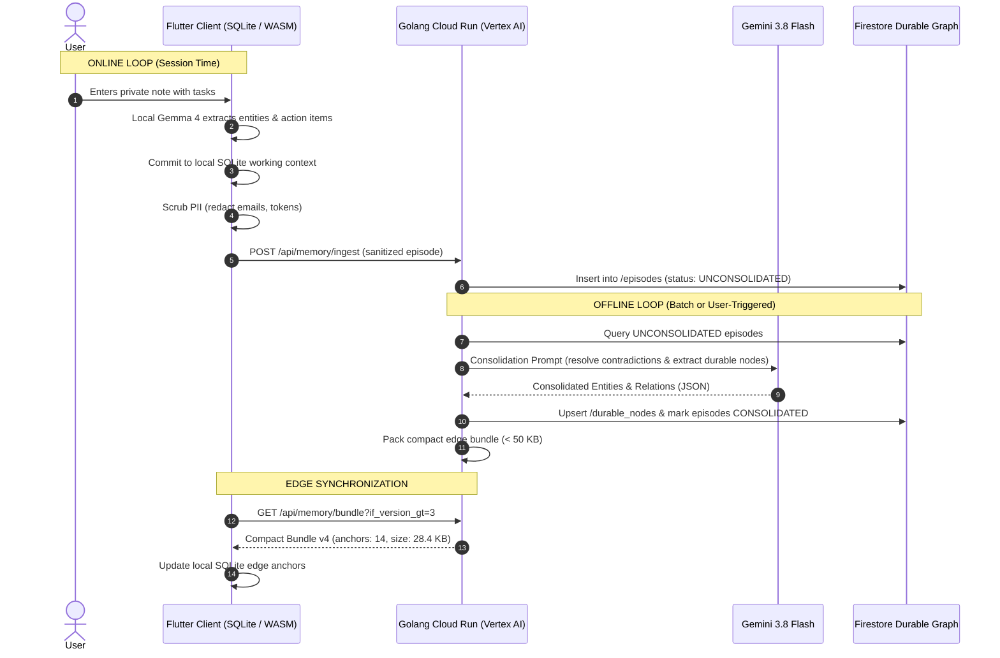

# Distributed AI Platform: Edge-to-Cloud Orchestration & Durable Memory

[](server/)
[](client/)
[](terraform/)
[](https://cloud.google.com/run)
[](LICENSE)

A production-grade, distributed AI platform demonstrating dynamic routing between on-device edge models (**Gemma 4** int4 via WebGPU and Android LiteRT, and **Gemini Nano** via Chrome Prompt API) and cloud reasoning (**Gemini 3.8 Flash** and **Nano Banana 2 Lite** multimodal synthesis on Google Cloud Run via Vertex AI).

---

## Architecture Overview

```
                      +------------------------------------------+
                      |         Flutter Client Workspace         |
                      |  - Academic / Sepia 3-Panel Layout       |
                      |  - LoreCraft Living Dynamic Game World   |
                      |  - Model Test Bench & LLM-as-a-Rater     |
                      +--------------------+---------------------+
                                           |
                                           v
                      +------------------------------------------+
                      |      Switching Router (Firebase AI)      |
                      |  - PII Detection & Edge-Local Redaction  |
                      |  - Token Budget & Latency Optimization   |
                      |  - Circuit Breaker Fallback Logic        |
                      +---------+----------------------+---------+
                                |                      |
         [Sensitive / Fast /    |                      | [Complex Synthesis /
          Offline / Sub-60ms]   |                      |  Multimodal / >4k tokens]
                                v                      v
     +----------------------------------+   +------------------------------------+
     |      On-Device Local Engine      |   |       Google Cloud Platform        |
     |  - Gemma 4 int4 (WebGPU / WASM)  |   |  - Go Backend (Cloud Run v2)       |
     |  - LiteRT-LM (Android Emulator)  |   |  - Vertex AI (Gemini 3.8 Flash)    |
     |  - Gemini Nano (Chrome Built-in) |   |  - Nano Banana 2 Lite (Images)     |
     |  - 0 KB Cloud Egress             |   |  - Cloud Firestore (Durable Graph) |
     +-----------------+----------------+   +-----------------+------------------+
                       |                                      |
                       +-------------------+------------------+
                                           |
                                           v
                      +------------------------------------------+
                      |       Dual-Loop Memory Architecture      |
                      |  - Online: SQLite / IndexedDB Context    |
                      |  - Offline: Cloud Run Consolidator       |
                      |  - Edge Bundle: Strict < 50 KB Budget    |
                      +------------------------------------------+
```



### Key Capabilities
- **Zero-Cloud Egress Edge Turns**: Quantized **Gemma 4 2B/4B** int4 models run client-side in Chrome WebGPU (or Android LiteRT CPU fallback) for sub-60ms TTFT, zero egress cost, and total privacy for sensitive PII (`RULE_STRICT_PRIVACY`).
- **Dynamic Cloud Escalation**: Deep architectural multi-hop synthesis queries stream from **Gemini 3.8 Flash** on Cloud Run over Server-Sent Events (SSE).
- **Multimodal Visual Synthesis**: On-demand game canvas and visual generation powered by **Nano Banana 2 Lite** (`gemini-3.1-flash-lite-image`) on Cloud Run (`RULE_GAME_VISUAL_SYNTHESIS`).
- **Dual-Loop Durable Memory**: Real-time client working memory (Online Loop) automatically syncs sanitized episodes to Cloud Run for asynchronous consolidation and contradiction resolution via Gemini 3.8 Flash (Offline Loop), indexing into Firestore and publishing compact edge memory bundles (< 50 KB).
- **Envoy 4-Phase Edge Memory Boot**: Four explicit memory tiers (On-Load Boot State $<4$ KB, Conditionally JIT Context, Pre-Emptive Caching, and Asynchronous 3 AM Syncs) ensuring bounded client memory footprint.
- **LLM-as-a-Rater Benchmarks**: Automated objective scoring harness comparing edge candidate outputs against golden cloud references across Semantic Fidelity, Instruction Compliance, Safety/PII Redaction, and Latency Efficiency.
- **LoreCraft Living World Studio**: Distributed gaming studio showcasing reactive edge NPC dialogue (`RULE_GAME_REACTIVE_BARK`), cross-faction campaign synthesis (`RULE_GAME_CAMPAIGN_SYNTHESIS`), dynamic 3-card next-turn generation, and live Canon Arbiter scorecards.

---

## Model Execution Matrix & Hardware Boundaries

| Environment | Model Engine | Model Name | Quantization / Format | Context Window | TTFT / Latency | Throughput / Modality | Egress / Privacy Boundary |
|---|---|---|---|---|---|---|---|
| **Browser (WASM/WebGPU)** | MediaPipe LLM WebGPU | **Gemma 4 2B / A4B** | int4 (`.task` / `.litertlm`) | 2,048–4,096 tokens | 60–140 ms | 25–40 tps (Text) | **0 KB Cloud Egress** (Fully Local) |
| **Browser (Built-in)** | Chrome Prompt API (`window.LanguageModel`) | **Gemini Nano** | 4-bit (~1.8B params) | 4,096–9,216 tokens | 30–55 ms | ~40 tps (Text) | **0 KB Cloud Egress** (Fully Local) |
| **Android Emulator** | LiteRT-LM CPU-fallback | **Gemma 4 2B** | int4 (`.litertlm`) | 2,048–4,096 tokens | 220–550 ms | 10–20 tps (Text) | **0 KB Cloud Egress** (Fully Local) |
| **Cloud Run (Vertex AI)** | Vertex AI Go SDK | **Gemini 3.8 Flash** | Full Precision (Cloud Hosted) | 1,048,576 tokens | 250–450 ms | 80+ tps (Text / JSON) | HTTPS with ADC Auth |
| **Cloud Run (Vertex AI)** | Vertex AI REST (`generateContent`) | **Nano Banana 2 Lite** (`gemini-3.1-flash-lite-image`) | Multimodal Generator | Variable | 1,100–1,400 ms | Base64 JPEG + Caption | HTTPS with ADC Auth |

### Two-Step Hybrid Orchestration Protocol
To prevent dead UI and eliminate unnecessary repeated cloud round-trips:
1. **Step 1 (Cloud Visual Synthesis)**: The player's visual prompt or A2UI action is dispatched to Cloud Run (`/api/image/generate`) using `gemini-3.1-flash-lite-image` (Nano Banana 2 Lite). The synthesized base64 image and caption materialize inside an `A2UISurface` visual canvas card attributed to the cloud backend.
2. **Step 2 (Local Edge Follow-Up Turn)**: Upon reception of the cloud asset, execution immediately advances to the local edge model (Gemma 4 int4 / Gemini Nano). The active NPC evaluates the newly materialized artifact in-character, delivers physical stage cues and spoken dialogue (<60ms TTFT, 0.0 KB egress), and dynamically generates the next proactive choice surface.

### Hardware Guardrails & Zero-Mock Directive
- **Apple Silicon Host Memory Guardrail**: Host machine is Apple Silicon (macOS). Heavy model training, fine-tuning, large weight loading, or unrolled autoregressive loops locally are strictly prohibited to prevent kernel watchdog panics. Local execution is restricted to fast unit tests and int4 inference; heavy multimodal generation belongs on Vertex AI / Cloud Run.
- **Strict Never Mock Directive**: Never mock, simulate, or hardcode fake inference data, synthetic streaming loops, or dummy fallback responses. If edge weights are uninitialized, the system either surfaces true errors or transparently triggers dynamic cloud escalation with truthful telemetry.

---

## Dynamic Switching Router & Intent Pills

The routing engine implements declarative evaluation based on five input dimensions: Visual Synthesis Intent, Privacy & Sensitivity, Token Capacity, Task Complexity, and Hardware/Network State.

### Prioritized Policy Rules

| Priority | Policy Rule | Target Route | Trigger Condition | Target Engine |
|:---|:---|:---|:---|:---|
| **100** | `RULE_STRICT_PRIVACY` | `EDGE_LOCAL` | PII detected (emails, SSNs, phone numbers, tokens, API keys) | On-Device Gemma 4 int4 (0 KB egress) |
| **90** | `RULE_GAME_VISUAL_SYNTHESIS` | `CLOUD_ESCALATE` | Requests to render concept art, blueprints, shields, or portraits | Nano Banana 2 Lite on Cloud Run (~1.2s) |
| **85** | `RULE_GAME_REACTIVE_BARK` | `EDGE_LOCAL` | In-character NPC dialogue barks, barters, and inventory inspections | On-Device Gemma 4 int4 (< 60ms TTFT) |
| **80** | `RULE_CONTEXT_LIMIT_EXCEEDED` | `CLOUD_ESCALATE` | Working context exceeds 4,096 tokens | Gemini 3.8 Flash (1M+ context window) |
| **75** | `RULE_GAME_CAMPAIGN_SYNTHESIS`| `CLOUD_ESCALATE` | Cross-faction treaty consequences, regional economic shifts | Gemini 3.8 Flash on Cloud Run |
| **70** | `RULE_COMPLEXITY_ESCALATION` | `CLOUD_ESCALATE` | Multi-hop architectural reasoning, temporal contradictions | Gemini 3.8 Flash on Cloud Run |
| **10** | `RULE_EDGE_DEFAULT_FAST` | `EDGE_LOCAL` | Default conversational turns under token threshold | On-Device Gemma 4 int4 (< 60ms TTFT) |

### Intent Pill Semantic Contract & Visual Mapping

An Intent Pill is not an ambient decorative label; it is a **functional contract badge** indicating classified user intent, policy justification, and memory delta:

| Intent Type | Visual Style | Badge Text | Expansion Behavior |
|:---|:---|:---|:---|
| **Visual Synthesis** | Azure Electric Indigo (`#eff6ff` / `#1565c0`) | `[☁️ Visual Synthesis: Nano Banana 2 Lite (~1.2s)]` | Expands decoded base64 visual asset canvas, prompt inspection, and cloud telemetry. |
| **Local Privacy** | Sage Olive (`#ecfccb` / `#3f6212`) | `[🔒 Local Privacy Intent: PII Sanitization & Task Extraction]` | Expands local sanitized entities table; confirms 0.0 KB cloud egress. |
| **Game Bark** | Sage Olive (`#ecfccb` / `#3f6212`) | `[⚔️ Game Reactive Bark: Sub-60ms On-Device Dialogue]` | Displays on-device TTFT latency (<60ms) and 0.0 KB egress. |
| **Campaign Synthesis** | Warm Amber (`#fef3c7` / `#b45309`) | `[🏰 Campaign Synthesis: Cross-Faction Consequence Simulation]` | Expands multi-faction treaty impact, durable lore anchors, and Canon Arbiter score. |
| **Cloud Synthesis** | Warm Amber (`#fef3c7` / `#b45309`) | `[🌐 Cloud Synthesis Intent: Cross-Session Architecture Alignment]` | Expands recalled durable memory anchors (`#arch-anchor-48`, `#team-pref-02`). |
| **Offline Fallback** | Terracotta (`#ffedd5` / `#c2410c`) | `[⚡ Offline Fallback Intent: Degraded Tactical Answer (Pending Sync)]` | Shows offline queue indicator and network circuit breaker state. |
| **Edge Fast** | Slate Stone (`#f4efe6` / `#57534e`) | `[⚡ Local Edge Fast Intent: Zero-Latency Execution]` | Displays sub-60ms TTFT telemetry and local SQLite commit status. |

---

## Durable Memory & Envoy Edge Boot Architecture



### Envoy 4-Phase Edge Memory Boot Flow
1. **Phase 1: On-Load (The Boot State)**: The edge agent initializes with only base directives and the **Master Index** ("The Map"), a compressed table of contents strictly capped under **4,096 bytes (4 KB)**.
2. **Phase 2: Conditionally (Just-In-Time Context)**: On-demand retrieval using `fetch_memory_topic(topic_id)`. Active context expands during task execution and is immediately evicted upon task completion to keep RAM footprint low.
3. **Phase 3: Pre-Emptive Caching (Predictive Load)**: State or geographic transitions pre-hydrate probable context files in background workers before user queries arrive.
4. **Phase 4: Asynchronous Syncs ("The Morning After")**: Cloud Dream consolidation runs asynchronously during idle periods (e.g. Wi-Fi + charging at 3 AM), publishing versioned delta updates and resolving contradictions.

---

## LoreCraft Dynamic World Engine & Studio

LoreCraft provides a grounded gaming showcase for distributed edge-cloud intelligence:
- **Dual-Model Decoupled Architecture**:
  - **Model 1: Conversational Persona Model ("Talking to User")**: Executes on-device (Gemma 4 int4 / Chrome Gemini Nano) with sub-60ms TTFT and 0.0 KB cloud egress. Speaks directly in-character with physical stage cues and immediate reactions.
  - **Model 2: Game Master Arbiter Model ("Assessing Next Actions")**: Executes on Cloud Run calling **Gemini 3.8 Flash**. Adjudicates tactical player actions against 5-stage quest objectives, calculates regional defense readiness deltas, shifts faction standings, and synthesizes 3 proactive choices.
- **Pre-Dialogue Mission Briefing**: Before contacting NPCs, players review the high-level situation (`OPERATION AETHER BREACH`), threat level, primary objectives, and multi-faction political stakes matrix.
- **Dynamic 3-Card Next-Turn Option Synthesis**: Following every dialogue turn, on-device Gemma 4 int4 synthesizes 3 context-aware next-turn cards (Local Dialogue, Local Tactical Maneuver, and Cloud Visual Synthesis) based on live dialogue history and active quest goals.

---

## UI/UX Design System & Academic Sepia Standards

The client interface implements an academic-light / sepia palette engineered for distraction-free reading, cognitive transparency, and high information density:
- **Parchment Surfaces**:
  - `canvas`: `#FAF7F2` (warm parchment background)
  - `paper`: `#FFFFFF` (elevated workspace sheets and primary panels)
  - `paperSubtle`: `#F7F4EE` (tinted card surfaces and code callouts)
  - `ink`: `#1C1917` (warm black typography)
  - `border`: `#E6DFD5` (subtle panel dividing lines)
- **Quiet Typography vs Actionable Affordances**:
  - Metadata attributes (timestamps, categories, status indicators) must never be enclosed inside non-clickable pill capsules (the "Confetti Pill" anti-pattern).
  - Use `SepiaTheme.statusDot(color, label)` for status indicators and `SepiaTheme.quietLabel(text)` for categories.
  - Interactive pill capsules are reserved strictly for executable user prompts, filters, or active toggles (`IntentPillWidget`).
- **Strict 2-3 Panel Layout**: Left Nav Rail for core domains, Center Main Workspace for active stream/studio, and Right Expandable Drawer for contextual telemetry, docs, and audit logs.

---

## Directory Layout

```
mult-agent-madness/
├── .env.example              # Environment variables template (no secrets)
├── package.json              # NPM automation shortcuts
├── start_emulator.sh         # One-click Android emulator & app launcher
├── client/                   # Flutter cross-platform client (Web WASM & Android)
│   ├── lib/                  # Dart application source (Sepia 3-panel layout)
│   ├── test/                 # Comprehensive unit, widget, and integration tests
│   └── web/                  # Web entrypoint, WebGPU & Chrome Prompt API bridges
├── server/                   # Golang Cloud Run v2 backend service
│   ├── cmd/server/           # Backend entrypoint (HTTP REST & SSE streams)
│   ├── pkg/config/           # Dynamic config & .env loader
│   ├── pkg/memory/           # Offline memory consolidator & edge bundle packer
│   ├── pkg/vertex/           # Vertex AI client (Gemini 3.8 Flash / ADC auth)
│   └── tests/                # Backend unit tests and LLM-as-a-Rater harness
├── shared/                   # Shared JSON contracts & schemas
│   ├── routing_policy.json   # Dynamic switching policy schema
│   ├── memory_schema.json    # Durable knowledge graph & edge bundle schema
│   └── eval_benchmarks.json  # Canonical rater test suites & golden references
├── terraform/                # Infrastructure as Code (Cloud Run, Firestore, GCS)
│   ├── main.tf               # Cloud Run v2, Firestore Native, Artifact Registry
│   ├── variables.tf          # Parameter declarations
│   └── terraform.tfvars.example # Environment variable template
├── scripts/                  # Automated toolchain wrappers & lifecycle scripts
│   ├── flutter / dart        # Hermetic Flutter/Dart invocation wrappers
│   ├── setup_android_sdk.sh  # Android SDK & cmdline-tools setup
│   ├── create_gemma_avd.sh   # Tuned ARM64 Gemma 4 Android Virtual Device
│   ├── run_android_emulator.sh # Boots emulator, compiles & launches app
│   └── teardown_eval_resources.sh # Ephemeral GCS benchmark pruning
└── docs/                     # Continuous Doc-Code-Test Parity Reference Guides
    ├── architecture.md       # Edge-to-cloud architecture specification
    ├── model_matrix.md       # Hardware execution matrix & constraints
    ├── memory_pipeline.md    # Online/offline memory sequence diagrams
    ├── routing_guide.md      # Dynamic switching router rules & circuit breaker
    ├── eval_rater_guide.md   # LLM-as-a-Rater benchmark specifications
    ├── lorecraft_dynamic_gameplay.md # Dynamic story engine & mission progression
    ├── ui_style_guide.md     # Antigravity sepia design tokens & affordance standards
    └── walkthrough.md        # Comprehensive deployment and verification runbook
```

---

## Prerequisites

| Tool | Version | Required For |
| :--- | :--- | :--- |
| **Google Cloud SDK (`gcloud`)** | Latest | GCP authentication, Cloud Run deployment, Vertex AI |
| **Go** | `>= 1.22` | Backend server, consolidator, and eval suite |
| **Terraform** | `>= 1.5.0` | GCP infrastructure provisioning |
| **Flutter SDK** | `>= 3.24` (Dart `>= 3.5`) | Client application (`scripts/flutter` provided) |
| **Node.js & npm** | `>= 18.0` | Optional convenience script runner (`npm run ...`) |
| **Java JDK** | `17` | Optional: Android emulator and APK compilation |
| **Android SDK** | API 34+ | Optional: Android emulator (`scripts/setup_android_sdk.sh`) |

---

## Manual Steps Required (First-Time Setup)

Before running or deploying the application, perform these one-time manual configuration steps:

### 1. Google Cloud Authentication & Application Default Credentials (ADC)
The backend uses Google Cloud Application Default Credentials (ADC) to interact with Vertex AI (`Gemini 3.8 Flash`) and Cloud Firestore. **No API key is required.**

```bash
# Log in to Google Cloud CLI
gcloud auth login

# Generate local Application Default Credentials (ADC) for Vertex AI SDK
gcloud auth application-default login

# Set your active GCP project
gcloud config set project <your-gcp-project-id>
```

### 2. Enable Required Google Cloud APIs
Enable the required services in your target GCP project:

```bash
gcloud services enable \
  run.googleapis.com \
  aiplatform.googleapis.com \
  firestore.googleapis.com \
  artifactregistry.googleapis.com \
  storage.googleapis.com \
  cloudbuild.googleapis.com
```

### 3. Provision Cloud Firestore (Native Mode)
The durable memory pipeline requires Cloud Firestore in Native mode:

```bash
# Create a Native Firestore database if one does not already exist
gcloud firestore databases create --location=us-central1 --type=firestore-native
```
*(If a database already exists in your project, verify its mode is Native under Cloud Console > Firestore).*

### 4. Configure Environment Variables (`.env`)
Create your local environment file from the provided template:

```bash
cp .env.example .env
```

Open `.env` and set your project parameters:
```dotenv
GCP_PROJECT=your-gcp-project-id
PROJECT_ID=your-gcp-project-id
GCP_REGION=us-central1
LOCATION=global
VERTEX_LOCATION=global
VERTEX_MODEL_ID=gemini-3.8-flash
CLOUD_BACKEND_URL=http://localhost:8080
PORT=8080
```
> **Security Note:** The `.env` file is explicitly ignored by `.gitignore` and must never be checked into version control. Never place service account keys or raw API tokens in tracked files.

### 5. (Optional) Accept Android SDK Licenses
If you plan to run the Android Emulator:

```bash
# Ensure ANDROID_HOME is exported
export ANDROID_HOME="${HOME}/Library/Android/sdk"
export PATH="${PATH}:${ANDROID_HOME}/cmdline-tools/latest/bin:${ANDROID_HOME}/platform-tools"

# Accept all Android SDK licenses
yes | sdkmanager --licenses
```

### 6. (Optional) Enable Chrome Built-in AI (Gemini Nano)
To test Gemini Nano directly inside Google Chrome:
1. Open Google Chrome (v128+).
2. Navigate to `chrome://flags/#prompt-api` (or `#prompt-api-for-gemini-nano`).
3. Set the flag to **Enabled**.
4. Relaunch Chrome.
5. Ensure your workstation drive has at least **22 GB** free space for the model weights.

---

## Installation & Local Execution

### Step 1: Provision Infrastructure via Terraform (Optional)
To provision Cloud Run, Artifact Registry, Firestore, and GCS buckets using Terraform:

```bash
cd terraform
cp terraform.tfvars.example terraform.tfvars
# Update project_id in terraform.tfvars

terraform init
terraform fmt -check
terraform validate
terraform plan -out=tfplan
terraform apply tfplan
cd ..
```

### Step 2: Run the Golang Backend Locally
The backend serves the REST API, SSE chat streaming, memory ingestion, offline consolidator, and LLM-as-a-Rater benchmark:

```bash
cd server
go run cmd/server/main.go
```

Verify backend health in a separate terminal:
```bash
curl -s http://localhost:8080/healthz | jq .
# Expected output: {"status":"ok","model":"gemini-3.8-flash","timestamp":"..."}
```

### Step 3: Run the Flutter Web Client
Launch the client in Google Chrome:

```bash
cd client

# Fetch dependencies
../scripts/flutter pub get

# Run on Chrome with WebGPU and backend URL defined
../scripts/flutter run -d chrome \
  --web-renderer canvaskit \
  --dart-define=CLOUD_BACKEND_URL=http://localhost:8080
```

The web application opens at `http://localhost:random_port/` with full WebGPU hardware acceleration.

### Step 4: Run the Android Emulator (Alternative Edge Platform)
To run on a tuned ARM64 Android Virtual Device:

```bash
# Convenience one-line boot script:
./start_emulator.sh

# Or using the granular step script:
bash scripts/setup_android_sdk.sh
bash scripts/create_gemma_avd.sh gemma4_edge_tablet
bash scripts/run_android_emulator.sh gemma4_edge_tablet http://localhost:8080
```

---

## Testing & Verification Suite

All tests can be executed locally without external cloud dependencies:

### 1. Backend Go Tests
Verifies offline memory consolidation, strict 50 KB edge bundle packing, episodic turn concurrency, and LLM-as-a-Rater parsing:

```bash
cd server
go test -v ./...
cd ..
```

### 2. Frontend Flutter Tests
Comprehensive test suite across 11 registered suites covering Switching Router, PII scrubber, LoreCraft World Engine, Canon Arbiter, and A2UI dynamic surface rendering:

```bash
cd client
../scripts/flutter test test/all_tests.dart
cd ..
```

### 3. LLM-as-a-Rater Benchmark Verification
The automated rater harness uses **Gemini 3.8 Flash** on Vertex AI as an objective judge to score candidate edge completions against golden references according to the canonical formula:

$$\text{Total Score} = 0.35 \times \text{SemanticFidelity} + 0.25 \times \text{InstructionCompliance} + 0.25 \times \text{SafetyPII} + 0.15 \times \text{EfficiencyFactor}$$

Run the automated scenario benchmark evaluator:

```bash
cd server
go test -v ./tests -run TestScenarioPromptsWithRater
cd ..
```

### 4. Terraform Validation
Ensure infrastructure code meets formatting and provider standards:

```bash
cd terraform
terraform fmt -check
terraform validate
cd ..
```

---

## Production Deployment to Google Cloud Run

Both frontend and backend services deploy seamlessly to Google Cloud Run in project `${GCP_PROJECT}`:

### 1. Deploy the Backend Service
```bash
# Load environment parameters
[ -f .env ] && set -a && source .env && set +a

# Deploy Go backend to Cloud Run
gcloud run deploy distributed-ai-backend \
  --source ./server \
  --region us-central1 \
  --project "${GCP_PROJECT}" \
  --platform managed \
  --allow-unauthenticated \
  --set-env-vars LOCATION=global,VERTEX_LOCATION=global,VERTEX_MODEL_ID=gemini-3.8-flash,AUTH_MODE=adc
```

Capture the deployed service URL (e.g. `https://distributed-ai-backend-<hash>-uc.a.run.app`).

### 2. Deploy the Frontend Client
```bash
# Build production web bundle with Cloud Run backend URL injected
cd client
../scripts/flutter build web --release --dart-define=CLOUD_BACKEND_URL="${CLOUD_BACKEND_URL}"

# Deploy static web server to Cloud Run
gcloud run deploy distributed-ai-frontend \
  --source . \
  --region us-central1 \
  --project "${GCP_PROJECT}" \
  --platform managed \
  --allow-unauthenticated
cd ..
```

### 3. Live HTTP Verification Probes
Verify live endpoints using HTTP probes:

```bash
# Probe 1: Healthcheck
curl -s -i "${CLOUD_BACKEND_URL}/healthz"

# Probe 2: Memory Edge Bundle (< 50 KB budget verification)
curl -s -i "${CLOUD_BACKEND_URL}/api/memory/bundle"

# Probe 3: Live Gemini 3.8 Flash Chat Stream
curl -s -i -X POST "${CLOUD_BACKEND_URL}/api/chat" \
  -H "Content-Type: application/json" \
  -d '{"prompt": "Summarize the durable memory policy.", "session_id": "test_session"}'

# Probe 4: Live Frontend Web App (Security Headers)
curl -s -i "${FRONTEND_URL}/"
```

---

## Resource Lifecycle & Teardown

To ensure no orphaned test resources or ephemeral storage blobs remain in your Google Cloud project after benchmarking:

```bash
bash scripts/teardown_eval_resources.sh
```

This automated teardown script safely prunes:
- Ephemeral benchmark evaluation outputs under `gs://${EVAL_BUCKET}/evals/`.
- Temporary local evaluation artifacts in `server/tmp_evals/`.

To destroy all Terraform-managed cloud resources:
```bash
cd terraform
terraform destroy
cd ..
```

---

## Documentation Index

Detailed architectural specifications, narrative guides, and deep-dive references are maintained under [`docs/`](docs/):

| Document | Focus & Coverage |
| :--- | :--- |
| **[Architecture Guide](docs/architecture.md)** | Complete edge-to-cloud system overview, topology, and component contracts. |
| **[Model Matrix & Constraints](docs/model_matrix.md)** | Hardware specs, context sizes, Chrome flags, Android ADB push, and TTFT benchmarks. |
| **[Memory Pipeline Specification](docs/memory_pipeline.md)** | Online/offline durable memory loops, Firestore schemas, and Envoy 4-phase boot flow. |
| **[Routing & Circuit Breaker Guide](docs/routing_guide.md)** | Firebase AI dynamic switching policy, intent pill semantics, and circuit breaker. |
| **[LLM-as-a-Rater Guide](docs/eval_rater_guide.md)** | Automated evaluation rubrics, dimensions, comparative model bench, and scoring harness. |
| **[LoreCraft Dynamic Gameplay](docs/lorecraft_dynamic_gameplay.md)** | Dynamic story engine, dual-model architecture, 5-stage quest tracks, and A2UI. |
| **[UI/UX Style & Affordances](docs/ui_style_guide.md)** | Academic sepia design tokens, quiet typography standards, and A2UI dynamic affordances. |
| **[Multi-Agent & Gemini Matrix](docs/gemini_agent_matrix.md)** | Multi-agent directory, prompt contracts, and model execution parameters. |
| **[Deployment Walkthrough & Runbook](docs/walkthrough.md)** | Comprehensive end-to-end verification runbook, user journeys, and test suite audit. |

### Reusable Agent Skills (`.agents/skills/`)
- [`ui-clarity-and-tdd`](.agents/skills/ui-clarity-and-tdd/SKILL.md): Mandatory planning, TDD, affordance enforcement, and clarity standards for client UI.
- [`edge-cloud-switching-router`](.agents/skills/edge-cloud-switching-router/SKILL.md): Dynamic switching rules, PII scrubbing, circuit breakers, and foresight pills.
- [`dual-loop-memory-pipeline`](.agents/skills/dual-loop-memory-pipeline/SKILL.md): Real-time local context, offline consolidation, <50 KB edge bundles, and Envoy boot.
- [`decoupled-narrative-arbiter`](.agents/skills/decoupled-narrative-arbiter/SKILL.md): Decoupled dual-model persona + game master arbiter orchestration with A2UI choices.
- [`fullstack-cloudrun-deploy`](.agents/skills/fullstack-cloudrun-deploy/SKILL.md): Google Cloud Run release deployment, ADC auth, live HTTP probe verification, and teardown.

---

## License

This project is licensed under the Apache License, Version 2.0 - see the [LICENSE](LICENSE) file for details.
