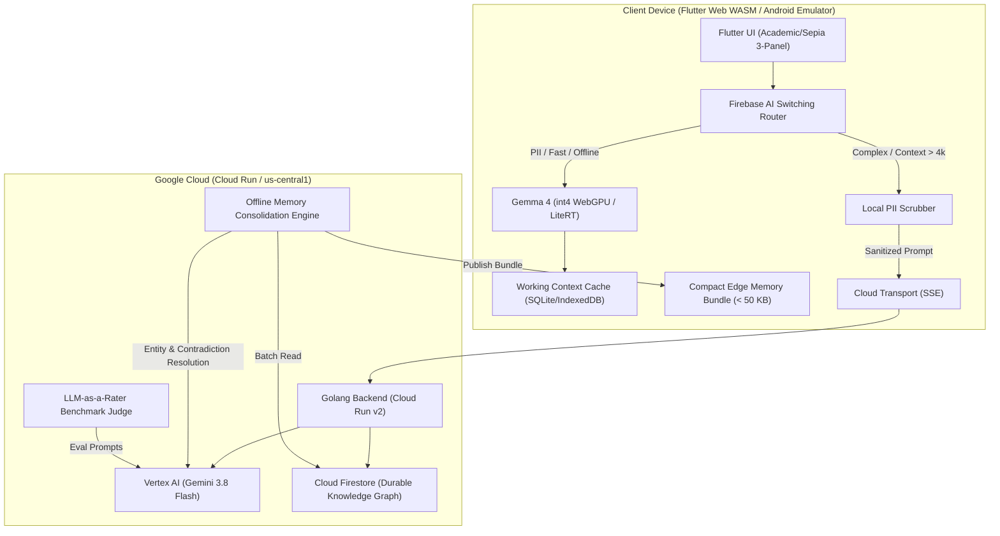

# Distributed AI System Architecture: Edge-to-Cloud & Durable Memory

## 1. Overview
Modern generative AI architectures must balance responsiveness, privacy, compute cost, and context size. This platform implements a production-grade distributed AI architecture where:
- **Edge Devices (Client)**: Run on-device **Gemma 4** models (quantized int4, 2k–4k context window) in Chrome WebGPU (WASM) and Android Emulator (LiteRT CPU fallback), along with **Gemini Nano** via the Chrome Prompt API, achieving zero cloud egress, sub-60ms TTFT, and immediate offline availability.
- **Cloud Infrastructure (Google Cloud Run)**: Runs **Gemini 3.8 Flash** with 1M+ token context capacity for deep architectural reasoning, multi-hop temporal synthesis, and offline durable memory consolidation, alongside **Nano Banana 2 Lite** (`gemini-3.1-flash-lite-image`) for multimodal visual synthesis.
- **Switching Router (Firebase AI Logic)**: Evaluates input token budget, privacy tags (PII extraction), local device health, and network state to dynamically determine execution path.
- **Dual-Loop Memory Pipeline**:
  - *Online Loop*: Local working context in SQLite/IndexedDB with client-side PII scrubbing prior to any cloud transition.
  - *Offline Loop*: Asynchronous consolidation in Golang Cloud Run using Gemini 3.8 Flash to extract entities, reconcile contradictions, update Firestore durable knowledge graphs, and push compact edge bundles (< 50 KB) back to clients.
- **LLM-as-a-Rater**: An automated evaluation benchmark using Gemini 3.8 Flash as an objective judge to score edge model outputs across fidelity, schema adherence, safety, and efficiency.

## 2. Component Boundaries & Contracts

For the complete repository tree, see [Directory Layout in README.md](../README.md#directory-layout).

The architecture enforces strict decoupling across four primary layers:
1. **Shared Contracts (`shared/`)**:
   - `routing_policy.json`: Declarative switching rules and circuit breaker thresholds.
   - `memory_schema.json`: Ingestion episode schema, durable knowledge graph schema, and 50 KB edge bundle schema.
   - `eval_benchmarks.json`: Canonical golden reference test suites for LLM-as-a-Rater scoring.
2. **Client Workspace (`client/`)**:
   - Academic / Sepia 3-Panel design system.
   - Reactive on-device execution manager detecting WebGPU, Chrome Prompt API (`window.LanguageModel`), and Android LiteRT method channels.
   - SQLite WASM working context cache with LRU turn pruning.
3. **Backend Service (`server/`)**:
   - Cloud Run v2 Go microservice exposing REST and SSE streaming endpoints (`/api/chat`, `/api/memory/*`, `/api/eval/*`, `/api/policy/*`).
   - Vertex AI SDK client authenticating via Google Cloud Application Default Credentials (ADC).
   - Asynchronous memory consolidation daemon reconciling temporal contradictions.
4. **Cloud Infrastructure (`terraform/`)**:
   - Terraform declarations for Cloud Run v2, Firestore Native Mode, Artifact Registry, GCS buckets, and least-privilege IAM bindings.

## 3. LoreCraft Dynamic World Engine & Studio
LoreCraft provides a grounded, tangible distributed AI wrapper for dynamic game worlds:
- **Reactive Edge NPC Dialogue (`RULE_GAME_REACTIVE_BARK`)**:
  - Executes on-device (Gemma 4 int4 / Chrome Gemini Nano) with < 60ms TTFT and 0.0 KB cloud egress.
  - Generates immediate stage directions, atmospheric banter, trade barter, and inventory inspections without breaking game loop frame budgets.
- **Cross-Faction Campaign Synthesis (`RULE_GAME_CAMPAIGN_SYNTHESIS`)**:
  - Escalates to Cloud Run (Gemini 3.8 Flash) for multi-hop consequence simulation, treaty renegotiations, and regional economic shifts across The Iron Vanguard, The Shadow Syndicate, and The Sylvan Enclave.
- **Compact World State Bundle (< 50 KB Budget)**:
  - Packs active region anchors, faction standings, NPC relationships, and recent episodic turns into an edge bundle strictly under 51,200 bytes.
- **Real-Time LLM Canon Arbiter (`BENCH_21_NPC_VOICE_CONSISTENCY`, `BENCH_22_LORE_CANON_FIDELITY`)**:
  - Continuous on-screen LLM-as-a-Rater scorecard evaluating dialogue turns across Voice Consistency, Canon Fidelity, and Frame Budget Compliance.
- **Pre-Dialogue Mission Briefing & Dynamic 3-Turn Option Synthesis**:
  - Players inspect the overarching crisis directive (`OPERATION AETHER BREACH`), threat level, primary objectives, and faction stakes matrix prior to persona contact.
  - On-device Gemma 4 int4 synthesizes 3 context-aware next-turn cards following each dialogue turn based on live conversation history and active quest goals (see [LoreCraft Dynamic Story Engine](lorecraft_dynamic_gameplay.md)).

## 4. Deep-Dive Documentation References
- [Model Matrix & Hardware Boundaries](model_matrix.md): Hardware specs, context sizes, and TTFT benchmarks.
- [Memory Pipeline Specification](memory_pipeline.md): Online/offline durable memory synchronization loops and Envoy boot architecture.
- [Routing & Circuit Breaker Guide](routing_guide.md): Firebase AI dynamic switching policy.
- [LLM-as-a-Rater Guide](eval_rater_guide.md): Automated evaluation rubrics, dimensions, and scoring.
- [UI/UX Style & Affordances](ui_style_guide.md): Antigravity sepia design tokens and quiet typography standards.
- [Multi-Agent & Gemini Model Matrix](gemini_agent_matrix.md): Multi-agent directory, prompt contracts, and model parameters.
- [Deployment Walkthrough & Runbook](walkthrough.md): Comprehensive step-by-step production runbook.
