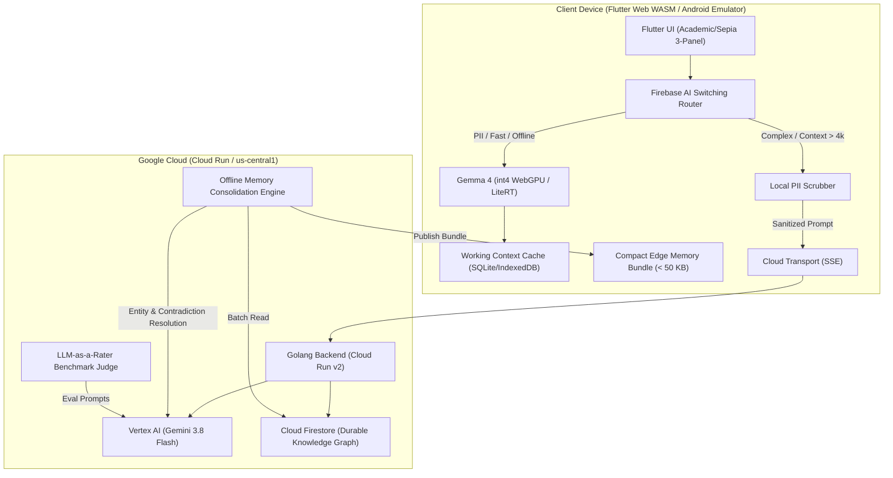

# Distributed AI System Architecture: Edge-to-Cloud & Durable Memory

## 1. Overview
Modern generative AI architectures must balance responsiveness, privacy, compute cost, and context size. This project implements a production-grade distributed AI platform where:
- **Edge Devices (Client)**: Run on-device **Gemma 4** models (quantized int4, 2k–4k context window) in Chrome WebGPU (WASM) and Android Emulator (LiteRT CPU fallback) to achieve zero-cloud egress, sub-60ms TTFT, and immediate offline availability.
- **Cloud Infrastructure (Google Cloud Run)**: Runs **Gemini 3.8 Flash** with 1M+ token context capacity for deep architectural reasoning, multi-hop temporal synthesis, and offline durable memory consolidation.
- **Switching Router (Firebase AI Logic)**: Evaluates input token budget, privacy tags (PII extraction), local device health, and network state to dynamically determine execution path.
- **Dual-Loop Memory Pipeline**:
  - *Online Loop*: Local working context in SQLite/IndexedDB with client-side PII scrubbing prior to any cloud transition.
  - *Offline Loop*: Asynchronous consolidation in Golang Cloud Run using Gemini 3.8 Flash to extract entities, reconcile contradictions, update Firestore durable knowledge graphs, and push compact edge bundles (< 50 KB) back to clients.
- **LLM-as-a-Rater**: An automated evaluation benchmark using Gemini 3.8 Flash as an objective judge to score edge model outputs across fidelity, schema adherence, safety, and efficiency.



## 2. Directory Structure
```
mult-agent-madness/
├── shared/                       # Contracts (routing_policy.json, memory_schema.json, eval_benchmarks.json)
├── terraform/                    # Cloud Run, Firestore, Artifact Registry, GCS, IAM
├── server/                       # Golang backend (chi, Vertex AI Gemini 3.8 Flash, Firestore)
├── client/                       # Flutter/Dart cross-platform client (Web WASM & Android)
└── docs/                         # Continuous Doc-Code-Test Parity Reference Guides
```

## 3. LoreCraft Dynamic World Engine & Studio
LoreCraft provides a grounded, tangible distributed AI wrapper for dynamic game worlds:
- **Reactive Edge NPC Dialogue (`RULE_GAME_REACTIVE_BARK`)**:
  - Executes on-device (Gemma 4 int4 / Chrome Gemini Nano) with < 60ms TTFT and 0.0 KB cloud egress.
  - Generates immediate stage directions, atmospheric banter, trade barter, and inventory inspections without breaking game loop frame budgets.
- **Cross-Faction Campaign Synthesis (`RULE_GAME_CAMPAIGN_SYNTHESIS`)**:
  - Escalates to Cloud Run (Gemini 3.8 Flash) for multi-hop consequence simulation, treaty renegotiations, and regional economic shifts across The Iron Vanguard, The Shadow Syndicate, and The Sylvan Enclave.
- **Compact World State Bundle (< 50 KB Budget)**:
  - Packs active region anchors, faction standings, NPC relationships, and recent episodic turns into an edge bundle strictly under 51,200 bytes.
- **Real-Time LLM Canon Arbiter (`BENCH_21_NPC_VOICE_CONSISTENCY`, `BENCH_22_LORE_CANON_FIDELITY`)**:
  - Continuous on-screen LLM-as-a-Rater scorecard evaluating dialogue turns across Voice Consistency, Canon Fidelity, and Frame Budget Compliance.
- **Pre-Dialogue Mission Briefing & Dynamic 3-Turn Option Synthesis**:
  - Players inspect the overarching crisis directive (`OPERATION AETHER BREACH`), threat level, primary objectives, and faction stakes matrix prior to persona contact.
  - On-device Gemma 4 int4 synthesizes 3 context-aware next-turn cards following each dialogue turn based on live conversation history and active quest goals (see [docs/lorecraft_dynamic_gameplay.md](lorecraft_dynamic_gameplay.md)).

