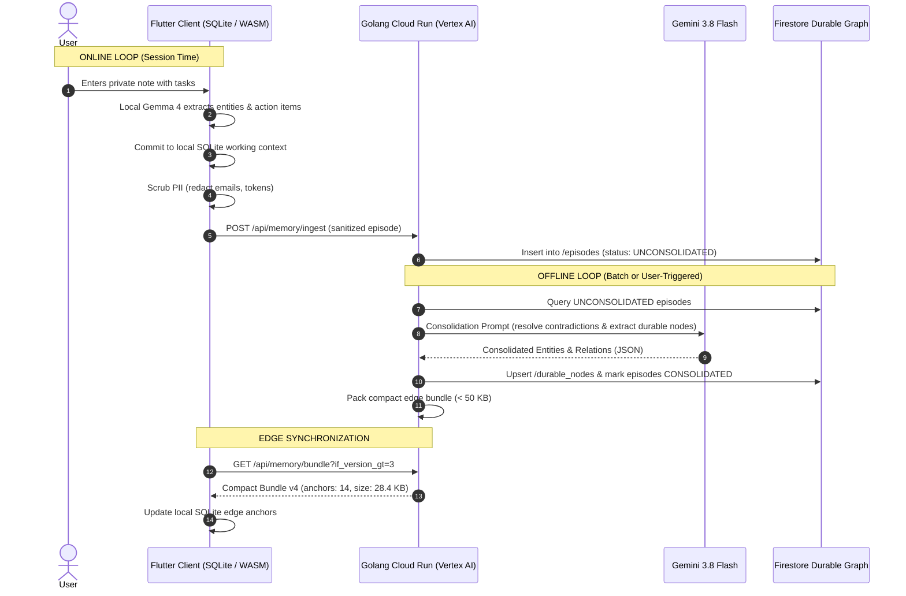
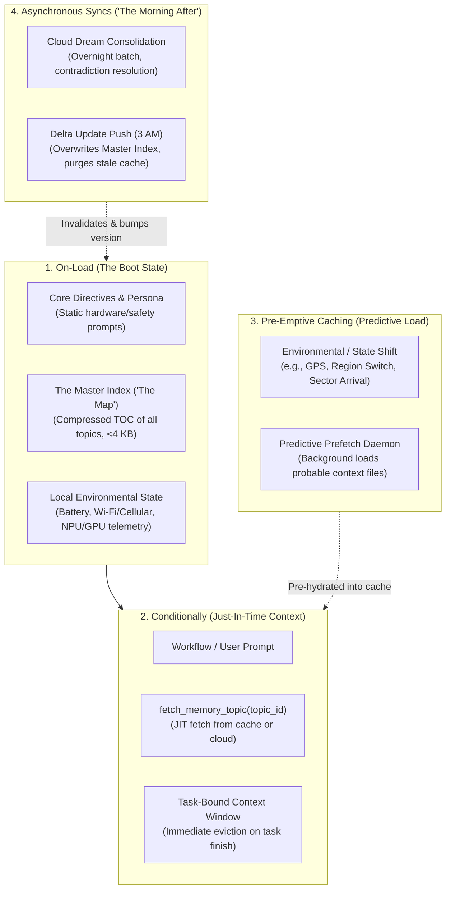

# Online and Offline Durable Memory Pipeline Specification

## 1. Overview
The durable memory architecture operates as two distinct, complementary synchronization loops:
1. **Online Loop (Real-Time Client Context)**: Micro-second local caching, privacy preservation, and streaming ingestion.
2. **Offline Loop (Asynchronous Cloud Consolidation)**: Batch synthesis, conflict resolution, durable knowledge graph indexing, and compact edge bundle distribution.

## 2. Ingestion & Storage Contracts

### Episode Collection (`/episodes/{episodeId}`)
Each turn committed by the client is stored in Firestore with:
- `sessionId`: Unique identifier for the conversation session.
- `timestamp`: ISO-8601 timestamp.
- `userPrompt`: Sanitized prompt.
- `modelResponse`: Edge or cloud completion.
- `route`: `EDGE_LOCAL`, `EDGE_FALLBACK`, or `CLOUD_ESCALATE`.
- `entities`: Array of extracted concepts.
- `status`: `UNCONSOLIDATED` | `CONSOLIDATED`.

### Durable Graph Collection (`/durable_nodes/{nodeId}`)
- `entityName`: Canonical name of the concept.
- `category`: `USER_PREFERENCE`, `SYSTEM_ARCHITECTURE`, `ROADMAP_DECISION`, `SECURITY_POLICY`.
- `summary`: Factual distillation of the consolidated knowledge.
- `confidence`: Score between 0.0 and 1.0.
- `relations`: Graph edges linking to other node IDs.
- `resolvedContradictions`: Audit log of contradictory statements resolved by Gemini 3.8 Flash.

### Compact Edge Memory Bundle
- Guaranteed maximum size: **50 KB**.
- Packed as compressed JSON containing distilled key-value context anchors.
- Loaded into client memory at startup for zero-latency local context injection.

## 3. Dual-Loop Architecture & Hardware Boundary Constraints

| Cognitive Tier | Storage Medium | Engine & Models | Latency & Headroom | Privacy / Egress Boundary |
|---|---|---|---|---|
| **Working Memory** | RAM / Volatile Scratchpad | Gemma 4 2B (int4 WebGPU / LiteRT) | <60ms TTFT, 2k–4k tokens | 100% ephemeral on-device |
| **Short-Term Memory** | SQLite WASM / Room DB | Local Regex + Gemma 4 PII Scrubber | <10ms local queries | Zero-cloud egress privacy gate |
| **Long-Term Memory** | Cloud Firestore Native | Vertex AI Gemini 3.8 Flash | Asynchronous batch loop | Consolidated semantic graph |
| **Edge Memory Anchors** | In-Memory JSON Cache | Packed Client Bundle (<50 KB) | 0ms local prompt injection | Distilled context without raw history |

### Hardware Boundary Guardrails
1. **Host Memory Ceiling (Apple Silicon & Mobile)**: To prevent macOS kernel watchdog panics and satisfy Android LiteRT 1.4 GB memory limits, raw conversational history is never accumulated uncompressed in client RAM. Working context turns are pruned via LRU beyond 5 active turns.
2. **Compact Edge Bundle Invariant**: The edge bundle payload is strictly capped at **50,000 bytes (50 KB)**. If the cloud consolidation process emits anchors exceeding this threshold, lower-ranked anchors are pruned or summarized prior to edge deployment.

## 4. Memory Lifecycle Studio & Interactive Components

The `MemoryLifecycleStudio` (`client/lib/views/memory_lifecycle_studio.dart`) provides complete visibility and testing control across the memory pipeline:

1. **Request/Response Lifecycle Diagram** (`MemoryRequestResponseDiagram`):
   - Interactive 4-stage trace: (1) Working Memory ➔ (2) Short-Term Memory ➔ (3) Cloud Consolidation ➔ (4) Durable Edge Distill.
   - Responsive layout: Horizontal pipeline on desktop ($\ge 700$px) and vertical chronological stepper on mobile devices (<700px).
   - Tapping any stage smoothly scrolls the viewport directly to the corresponding notebook cell.
2. **Computational Notebook Cells** (`MemoryNotebookCell`):
   - **Cell 1**: Working Memory (Active Context Window & Scratchpad) with LRU Pruning.
   - **Cell 2**: Short-Term Memory (SQLite & Ingestion Queue) with Queue Drain control.
   - **Cell 3**: Long-Term Memory (Cloud Knowledge Graph) with Gemini 3.8 Flash Consolidation trigger.
   - **Cell 4**: Edge Bundle Invariant (<50 KB) with Bundle Repacker control.
3. **Hierarchical Dual-Tree Inspector** (`MemoryTreeView`):
   - Renders the hierarchical tree structure of the Local Memory Cache (SQLite/RAM) alongside the Cloud Firestore Knowledge Graph.
   - Responsive format: Side-by-side split pane on desktop ($\ge 1050$px) and Segmented Switcher (`[ 📱 Local Tree ]`, `[ ☁️ Cloud Graph ]`, `[ ⚡ Diff ]`) on mobile devices.
   - Includes interactive Contradiction Resolution Audits detailing active vs. superseded directives, consolidation rationale, and one-click rollback.
4. **Memory Pattern Simulator** (`MemoryPatternTester`):
   - **Scenario 1: Inject Contradictory Directive**: Simulates conflicting user constraints (e.g., FP16 precision vs. 2 GB RAM limit) and verifies Gemini 3.8 Flash conflict resolution.
   - **Scenario 2: Stress 50 KB Bundle Budget**: Injects heavy enterprise policy anchors to verify the budget invariant meter.
   - **Scenario 3: Toggle Offline Mode**: Partitions network connectivity to verify local SQLite resilience and zero cloud egress.
   - **Reset Baseline**: Restores memory state to pristine defaults.

## 5. UI/UX Design System & Quiet Typography Mandates

To ensure visual clarity, prevent cognitive fatigue, and eliminate false affordances:
- **No False-Affordance Pill Boxes**: Metadata attributes (categories, timestamps, status indicators) must never be enclosed inside non-clickable rounded pill capsules.
- **Quiet Typography**: Implemented via `SepiaTheme.quietLabel()`, `SepiaTheme.statusDot()`, and `SepiaTheme.metricText()`.
- **Intent Pills Only**: Interactive pill capsules are reserved strictly for executable user prompts, filters, or active toggles.

## 6. Envoy Edge Memory Architecture & 4-Phase Boot Flow

The game and edge runtime implement an explicit four-pattern memory architecture to ensure zero-latency local execution, bounded RAM consumption, and predictive pre-hydration:

### 1. On-Load (The Boot State)
When the edge agent spins up, it loads only the absolute minimum context required to triage incoming events and route tasks:
- **Core Directives & Persona**: Static system prompt governing behavior on the target hardware engine (e.g. LiteRT / WebGPU).
- **The Master Index ("The Map")**: Instead of full historical documents, the agent loads a highly compressed directory generated by the cloud's dream phase. The agent knows *what* it knows without incurring the memory footprint of raw content. Strictly enforced under **4,096 bytes (4 KB)** budget.
- **Local Environmental State**: Immediate device context (battery level, AC power, network connectivity, hardware acceleration tier).

### 2. Conditionally (Just-In-Time Context)
The vast majority of semantic memory is paged in on demand:
- **Tool-Triggered Fetching**: When user prompts require historical lore or domain rules, the edge agent checks its Master Index and executes `fetch_memory_topic(topic_id)` to pull the specific payload.
- **Task-Bound Context Windows**: Injected topics expand the context window only during the active workflow. Upon task completion, injected topics are immediately evicted, returning edge memory footprint to base directives.

### 3. Pre-Emptive Caching (The Predictive Load)
For latency-sensitive edge interactions where on-demand network roundtrips would stall the user:
- **State-Based Prefetching**: When the agent detects an environmental or state transition (e.g. player enters Sunken Aqueducts or GPS indicates arrival), background workers pre-emptively load relevant topic files into local memory before queries arrive.

### 4. Asynchronous Syncs (The "Morning After")
Edge memory continuously evolves via overnight cloud consolidation:
- **Delta Updates**: During low-activity periods (e.g. Wi-Fi + charging at 3 AM), the cloud dream daemon pushes a versioned delta update resolving contradictions and pruning deprecated knowledge.
- **Cache Invalidation**: The edge agent overwrites its local Master Index and invalidates all locally cached topic files deprecated or modified by the cloud.

### 5. First-Run Boot Experience (`LoreCraftBootPageView`)
Upon entering the game for the first time, users are presented with the interactive Envoy Edge Boot Page:
- Live hardware telemetry strip showing battery, connection status, hardware engine, and < 4 KB footprint budget verification.
- Interactive controls to trigger live topic fetches, run task-bound workflows with token eviction monitoring, simulate predictive state shifts, and run 3 AM Cloud Dream delta syncs.
- `[INITIALIZE ENVOY & ENTER THE WORLD ➔]` primary CTA transitioning into tactical crisis briefings.
- Direct navigation access via the `[⚡ BOOT SEQUENCE]` pill and left navigation rail (`ShellNavDestination.bootSequence`).

### 6. Educational Efficacy Rater (`EducationEvalRater` & `EducationAssessmentCard`)
Embedded directly within the Envoy Boot Page, an automated assessment engine audits how effectively players learn edge computing and memory architecture patterns:
- **Rubric Dimensions**:
  - *Concept Retention (30%)*: Evaluates clarity on the "Map is not the Territory" rule, JIT on-demand paging, and asynchronous 3 AM consolidation.
  - *Tactile Interactivity (30%)*: Verifies player affordances for live byte counters, dynamic JIT topic paging, and context eviction meters.
  - *Cognitive Simplicity (20%)*: Assesses plain-English explanations, visual progress meters, and zero unexplained jargon.
  - *Gameplay Cohesion (20%)*: Measures how seamlessly edge concepts map to in-game survival (e.g. valve ciphers, sluice bypasses, keystone harmonics).
- **Executive Card UI**:
  - Distraction-free sepia card featuring an Executive Letter Grade badge (`GRADE: A+ (96.5%)`), dimension meters, bulleted key takeaways, and a collapsible 4-phase pedagogical breakdown accordion.

### 7. Interactive Environmental Sandbox & Adaptive Routing Policies
To demonstrate how physical edge constraints dictate intelligence routing, the hardware telemetry bar provides real-time simulation toggles:
- **Battery Simulation Toggle (`btn_toggle_battery_sim`)**: Cycles device charge between Nominal (88%, AC Charging) and Critical (12%, Battery).
- **Network Simulation Toggle (`btn_toggle_network_sim`)**: Cycles connectivity between Nominal (`ONLINE_WIFI`) and Partitioned (`OFFLINE_AIRGAPPED`).
- **Adaptive Edge Routing Policies (`EdgeRoutingPolicy`)**:
  - **Full Performance**: Nominal power and connectivity. Unrestricted edge runtime, cloud escalations, predictive background prefetching, and overnight 3 AM syncs active.
  - **Low Power (<15%)**: Critical battery. Background prefetching throttled, cloud visual renders deferred, strictly prioritizing on-device Gemma 4 int4.
  - **Air-Gapped Offline**: Zero network interface. Semantic queries strictly resolved via local cached topic files (0ms local response); 3 AM Dream Delta queued for reconnection.
- **Three Context Questions Compliance**: The responsive policy guidance banner answers: (1) What is this status? (2) Why did it change? (3) What should the player do next?

### 8. Tactical Milestone Toasts & Zero-Dependency Audio Feedback
Player dialogue choices dynamically unlock tactical objectives and trigger sensory feedback:
- **Objective Milestone Toast (`ObjectiveMilestoneToast`)**: Slide-and-fade banner with sepia paper background, sage/amber border accents, faction reputation delta (+4 REP), and exact 0ms cache route citations (`undercity_sluice_bypass`).
- **Audio Feedback Service (`AudioFeedbackService`)**: Zero-dependency audio-haptic engine using `SystemSound` and `HapticFeedback` with graceful fallback for headless CI test runners:
  - *Boot Chime*: Ascending acoustic chime for boot initialization and 3 AM dream consolidation.
  - *Tactile Click*: Crisp mechanical tick on JIT topic fetches, toggle taps, and dynamic dialogue choices.
  - *Evict Pulse*: Low resonant pulse when task-bound context is purged from memory.
  - *Milestone Fanfare*: Uplifting cue upon objective achievement.
  - *Global Sound Toggle (`btn_toggle_sound`)*: Complete mute control across the entire edge runtime.

---

## 7. Related Documentation
- [System Architecture](architecture.md): Distributed edge-to-cloud topology.
- [Model Matrix & Hardware Boundaries](model_matrix.md): Local RAM constraints and execution engines.
- [Routing Guide](routing_guide.md): Dynamic switching policies and PII redaction boundaries.
- [LoreCraft Dynamic Gameplay](lorecraft_dynamic_gameplay.md): Game engine integration and mission progression.

